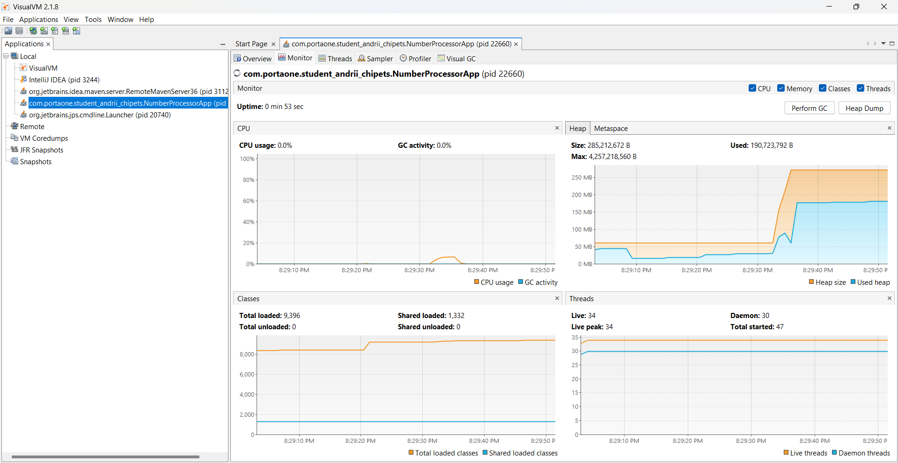
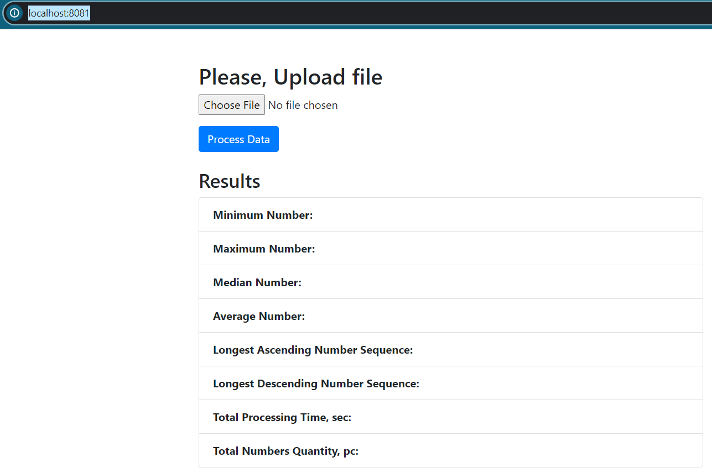
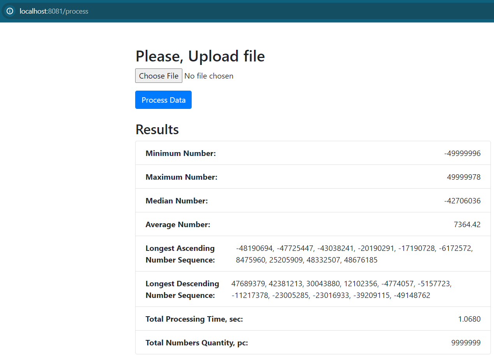

# Number Processor

## Table of Contents
1. [Introduction](#introduction)
2. [Technologies Used](#technologies-used)
3. [Challenges](#challenges)
4. [Getting Started](#getting-started)
5. [Additional Features](#additional-features)
6. [Contributing](#contributing)
7. [Pay attention](#pay-attention)

## Introduction

This application was developed as a test task application for PortaOne company intern contest (BAD).
The program reads data(numbers) from the file, processes them, and returns:
- min number,
- max number,
- avg number,
- median number,
- longest ascending sequence,
- longest descending sequence,
- total process time
- total number quantity

## Technologies Used

- Java 17
- Spring Boot
- Spring Web
- Thymeleaf
- Log4j2
- Lombok
- JUnit

## Challenges

To solve this challenge I've done the following:
- used the VisualVM 2.1.8 application to monitor the virtual machine heap memory usage (https://visualvm.github.io/)
  
- used array instead of ArrayList to store data from a file, because of an array can operate with primitive data type int, while ArrayList only objects - Integer.
- I specified virtual machine heap size 400MB through Dockerfile to allocate more memory on render.com.
  (Dy default virtual machine allocates about 25% of the total RAM memory and in case of 512MB render.com RAM memory will be about 125MB)
  All this actions allow us to run this application online without OutOfMemory error.
  I understand that in some case the error can occur again, but for test task and such resource restrictions, I think it's enough for now.

## Getting Started

You have two options:
1. Online version of the application (works slower than offline) - just follows this link: [online]https://number-processor.onrender.com
2. Offline version of the application:
- to run this application locally, please use Docker application. You can download it from: https://www.docker.com/
- download to your PC the Number Processor application folder from the GitHub repository and extract files from the archive: https://github.com/AndriiChipets/number-processor
- run the command line interface inside folder of the Number Processor application: number-processor-master
- to create an application docker image, please run in cmd following command (including "." at the end of the command): docker build -t numbers .
- to run docker container with application, please run in cmd following command: docker run --name numberprocessor -d -p 8081:8080 numbers
- go to your browser and follow to the local address: http://localhost:8081
- you should be able to see program interface:

- choose the file with numbers and press Process Data button and you should be able to see the result of the processing:

- to stop docker container, please execute command: docker stop numberprocessor
- to start existing container again. please execute command: docker start numberprocessor

## Additional Features

- Readme file to guide developers and contributors

## Contributing

Contributions are welcome! If you have ideas or improvements, feel free to submit a pull request.

## Pay attention

### File and data requirements

1. File format only .txt (e.g. test.txt)
2. Maximum file size restricted by the program properties - 91MB
3. Program accepts ONLY Integer numbers on the range: -2_147_483_648 to 2_147_483_647
4. The file data structure must follows several rules:
- only one number in one line
- number delimiter is "\n" (new line)
- data structure example:
0  
50  
301  
-44  
100  
-124  
-1000

### Online version of the application (https://number-processor.onrender.com)

1. Application hosted on the free web server which provides 512MB of RAM memory and 0.1CPU
2. First application start may execute during 50sec.
3. The number process time about 10c and about 20sec to download file with size 90MB to the server

### Offline version
1. Application available on http://localhost:8080/, when start by IDE
2. Application available on http://localhost:8081/, when start by Docker